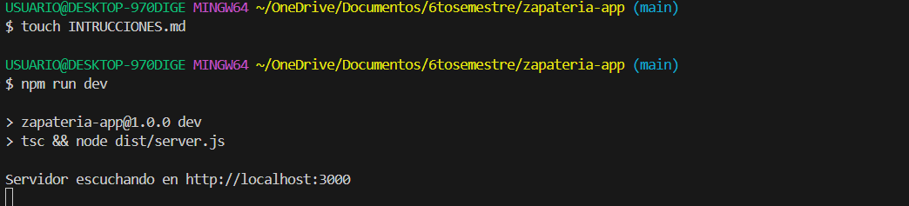
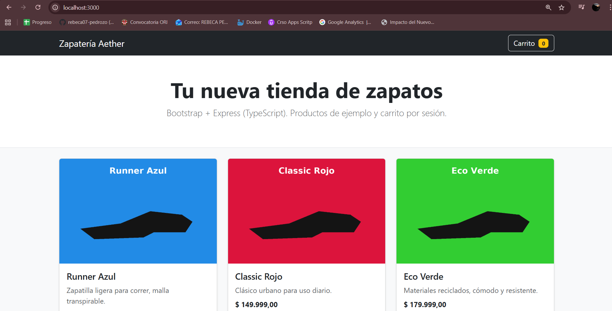

Instrucciones paso a paso

Es fundamental tener: 
- Node.js v18+ instalado.
- npm (viene con Node).


# Entrar al proyecto
cd ~/OneDrive/Documentos/6tosemestre/zapateria-app

# Paso 2 — Instalar dependencias

Ejecutar: 

```
npm install
```

Personalmente apareció el mensajde de: Could not find a declaration file for module 'cors', por el eso tocó instalar el tipo:

```
npm install --save-dev @types/cors
```

# Paso 3 — Preparar scripts

Cambiar el package.json al script dev

```
"scripts": {
  "dev": "tsc && node dist/server.js",
  "build": "tsc",
  "start": "node dist/server.js"
}
```

# Paso 4 — Compilar y ejecutar 

Ejecutar: 

```
npm run dev
```


Con esto vemos en la terminal el seguiente mensaje:  Servidor escuchando en http://localhost:3000



# Paso 5 — Verificar en el navegador / API

```
Frontend: http://localhost:3000
```
Lista de productos (API): http://localhost:3000/api/products


